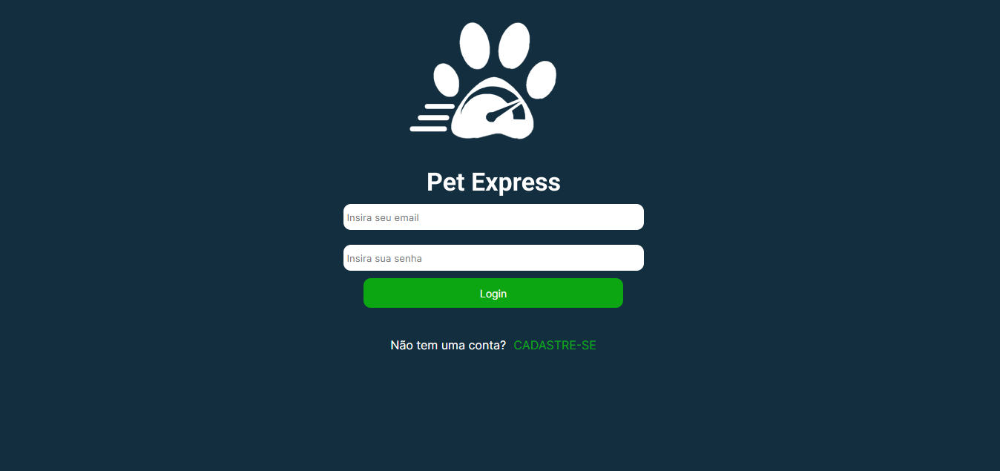

# Pet Express

 O pet Express é uma aplicação feita em php. O projeto em questão trata-se de um modelo exclusivo para o transporte de Pet’s em geral, com o intuito de servir para levar o animal até Pet shop’s em busca de cuidados com higiene, veterinário, etc. Além disso, tem como propósito também ser um transporte pessoal do animal para lugares em que o público possa usufruir para passeio ou visita. Tudo isso com o foco especial no Pet, zelando pela sua segurança e cuidado.

# Para utilizar a aplicação

1. Git clone
2. Install Xampp
3. Create bd in phpmyadmin 
4. Name bd 'petexpress'
5. Import bd petexpress.sql
6. Run!

